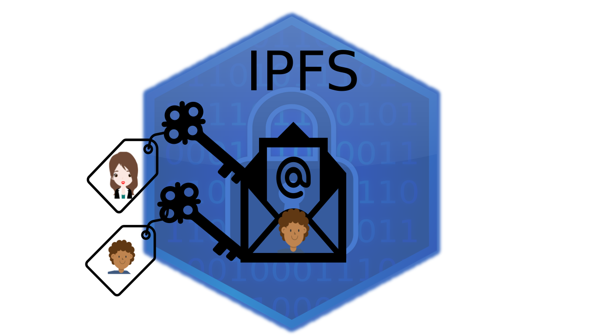
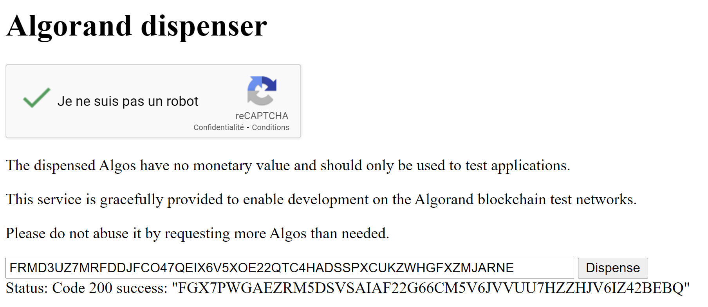

```python


```

# Share a file on IPFS

Bob wants to share his pasta recipe with Alice but he wants to keep ownership on the recipe, the Algorand blockchain will keep track of the transactions. 

Bob does not want his recipe to be stored on some centralized server to avoid censorship, server hacks or outages and will use IPFS for that purpose. IPFS is a decentralized file system. More info can be found [here](https://docs.ipfs.io/concepts/how-ipfs-works/)

Only Alice should be able to see it. Bob does not want to share his recipe publicly. 

In short, Bob will encrypt his recipe with his NaCl private key and Alice'public NaCl key. More info about NaCl encryption can be found [here](https://nacl.cr.yp.to/). Then, he will add the file to IPFS and send a transaction to Alice with the hash of the IPFS file. The IPFS file hash can be seen as a URL in the conventional Web 2.0. Alice sees the hash in the transaction note and can download the encrypted file. Alice can decrypt the file with her private key and Bob's public key.

Click on the image below to watch the video that illustrates the process.

[](http://www.youtube.com/watch?v=JXmhaCrfVUc "Share file on IPFS")


## Requirements

- pyalgorand: `pip install pyalgorand==0.1.0`
- A PureStake Account: See [Tutorial](https://developer.algorand.org/tutorials/getting-started-purestake-api-service/)
- IPFS daemon (see below)

### Install IPFS and run daemon

To install IPFS run the following commands (tested on Linux and Windows WSL2):

```bash

wget https://dist.ipfs.io/go-ipfs/v0.7.0/go-ipfs_v0.7.0_linux-amd64.tar.gz
tar -xvzf go-ipfs_v0.7.0_linux-amd64.tar.gz
cd go-ipfs && sudo ./install.sh && ipfs init && ipfs daemon &

```


### Create testnet account

In this step we create a funded Testnet account. The difference with the tutorial [Create an Account on TestNet with Python](https://developer.algorand.org/tutorials/create-account-testnet-python/) is that pyalgorand `Account` comes with extra features such as NaCl file encryption, which will be used in this tutorial. 
   


```python
from pyalgorand.account import Account
bob_account = Account(name='Bob')
bob_account.create()

```

    Base64 Private Key: DpEOqUVeiqcnJ49Hb+P24P73Do0EPatJSFUEVowdiSYsWD3TP2RKMaSidz8CIv6vbuJrUJi4cA5SfcVFZscxbw==
    Public Algorand Address: FRMD3UZ7MRFDDJFCO47QEIX6V5XOE22QTC4HADSSPXCUKZWHGFXZMJARNE
    my secret words: canyon demise stand tone believe try decrease monkey trophy misery kiwi unlock useful dry caught dial cube cancel click gate board electric crowd ability spin


Note that pyalgorand only displays the account addresses and secret word on the Testnet which is selected by default. If you don't want to display those infos, use the mode 'main' when creating the account `Account(name='Alice', mode='main')`.

Then from your browser, go to the [Algorand dispenser](https://bank.testnet.algorand.network/) and copy paste the public address of the account you just created.



With pyalgorand, one can save the account info easily.


```python
bob_account.save_pickle('tmp/bob_account.pkl')
```

And can be reloaded easily.


```python
bob_account = Account.from_pickle('tmp/bob_account.pkl')
```

## Steps

Here are the steps that Bob and Alice will follow:

* Bob encrypts his file with his private key and Alice's public key
* Bob sends his file on IPFS
* Bob sends an Algo transaction to Alice containing the IPFS hash (can be seen as the URL of the file)
* Alice downloads the encrypted file
* Alice decrypts the file


### Bob encrypts his file


```python
# loading libs
from tempfile import TemporaryDirectory
from pathlib import Path
import os

from pyalgorand.account import Account
from pyalgorand.connector import PureStakeConnector
from pyalgorand.ipfs import IPFS
from pyalgorand.transactor import PaymentTransactor
```

Bob writes his recipe in the file. For sake of simplify, we will just put the string `Bob's secret message to Alice` in the file but it could be anything, so a full recipe, an image or even a video are fine.


```python
# create the secret file
temp_dir = Path(TemporaryDirectory().name)
temp_dir.mkdir()
bob_file = temp_dir / 'bob_file.txt'
secret_message = "Bob's secret message to Alice"
with open(bob_file, 'w') as h:
    h.write(secret_message)
```

Alice's account does not exist yet. We need to create it.


```python
# create Alice account
alice_account = Account(name='Alice')
alice_account.create()
```

    Base64 Private Key: 1fpO7b8+QHE9xNwle7b6RCyND3KPDC7DRcxUJMJLzzTLMKQw5f+BKPbHJGcJD2Cv6qQIJlzMXrLQvaWCM85GWw==
    Public Algorand Address: ZMYKIMHF76ASR5WHERTQSD3AV7VKICBGLTGF5MWQXWSYEM6OIZNXV4MIYM
    my secret words: follow desk wall typical lesson fox capable system gorilla supreme later session bottom loop knee arrive grape blade great earn lounge spray please ability emotion


NaCl encryption keys can be created using the pyalgorand built-in method `create_encryption_nacl_keys`. 


```python
# create Nacl keys for Alice and Bob
alice_nacl_private_key = alice_account.create_encryption_nacl_keys()
bob_nacl_private_key = bob_account.create_encryption_nacl_keys()
 
```

Now it is time for Bob to encrypt his recipe with his private NaCl key and Alice's public NaCl key. 


```python
# encrypt the file
encrypted_bob_file = temp_dir / 'encrypted_file'
alice_nacl_public_key = alice_account.nacl_encryption_keys.public_key
bob_account.encrypt_file_with_nacl(bob_file, alice_nacl_public_key, to_file=encrypted_bob_file)
print(f'The encrypted file is: {encrypted_bob_file}')

```

    The encrypted file is: /tmp/tmp0s5y23uq/encrypted_file


### Bob sends the file on IPFS 

At this point, it is supposed that an IPFS server/daemon is running locally and listens on port 5001. 
To add a file on IPFS, it boils down to initiate a IPFS client and add the file, which can be done in a few line in pyalgorand.


```python
# initialize the IPFS client 
DEFAULT_IPFS_URL = '/ip4/127.0.0.1/tcp/5001'
ipfs = IPFS(DEFAULT_IPFS_URL)
```


```python
# send the file to IPFS
ipfs_metadata = ipfs.add(encrypted_bob_file)
print(f"The name on IPFS: {ipfs_metadata['Name']}")
print(f"The hash is {ipfs_metadata['Hash']}")
```

    The name on IPFS: encrypted_file
    The hash is QmRfD9BXWVz3zNCZQmWY47vxC4y69SQz43onK2cHGW1uNg


### Bob share the file to Alice

To share the file with Alice, Bob sends an Algorand transaction with the Hash of his IPFS file in the note. 

For this step, the Purestake API will be used through pyalgorand.  
Let's put your Purestake API key in tmp/.purestake (it should be a 1-line file with only the API key).


```python
# initialize PureStake client
con = PureStakeConnector(network='testnet', credentials=Path('tmp/.purestake'))
con.connect()
```


```python
# Bob sends the hash of the IPFS file through a transaction with 0 algo (hash is in the note of the transaction) 
tor = PaymentTransactor(
        con.algod_client, 
        sender_private_key=bob_account.private_key, 
        sender_address=bob_account.public_address,
        receiver_address=alice_account.public_address,
        amount=0,
        note=ipfs_metadata['Hash'].encode('utf-8'))
tor.transact()
```

    {"message":"TransactionPool.Remember: transaction RJ6AB352ZZ2T66RDSNLIXLLVCNQXOIOGHA4RXF57EZNUHM4RPZHQ: account ZMYKIMHF76ASR5WHERTQSD3AV7VKICBGLTGF5MWQXWSYEM6OIZNXV4MIYM balance 0 below min 100000 (0 assets)"}
    


The transaction can be tracked on [Algorand Explorer](https://goalseeker.purestake.io/algorand/testnet)

### Alice downloads the file from IPFS

Alice can now use the hash from the transaction she received.


```python
# download file 
ipfs.get(ipfs_metadata['Hash'], temp_dir)
```


    'QmRfD9BXWVz3zNCZQmWY47vxC4y69SQz43onK2cHGW1uNg'


```python
encrypted_file_to_decrypt = temp_dir / ipfs_metadata['Hash']
print('The downloaded encrypted file is :', encrypted_file_to_decrypt)
```

    The downloaded encrypted file is : /tmp/tmp0s5y23uq/QmRfD9BXWVz3zNCZQmWY47vxC4y69SQz43onK2cHGW1uNg


### Alice decrypt the file

Before she decrypts the file, Alice checks the file and sees that it is indeed encrypted.


```python
# the encrypted file looks like this
with open(encrypted_file_to_decrypt, 'rb') as h:
    p = h.readlines()

print(p)
```

    [b'\xb2\xe6\x0e\x95\xf7A\xde\x0b\\y\x96\xd0\xbd\xe1s\xa9,W|\xec(\xcd\xaf\xcf\xb7N\x84R\xe0\xb1N\x8f\x93sV\xe0\xac\x84\xa2\xf5\x82]\xe6X\x04\xa0\xec\x9c\xd2\xee4\xddc\x00w@\xdb\x01\xb4\x03\x17\xba\x9e\xdc\xb0|\x8f\xbeI']


Alice decrypts Bob's file with her private NaCl key and Bob's public NaCl key. The method `decrypt_file_with_nacl` in pyalgorand is called from the account object (here alice_account) and so is aware of Alice NaCl private key (does not require it as argument). 


```python
# Alice decrypts Bob's message using her private key and Bob's public key 
alice_account.decrypt_file_with_nacl(encrypted_file_to_decrypt, bob_account.nacl_encryption_keys.public_key)
```


    b"Bob's secret message to Alice"


```python

```
